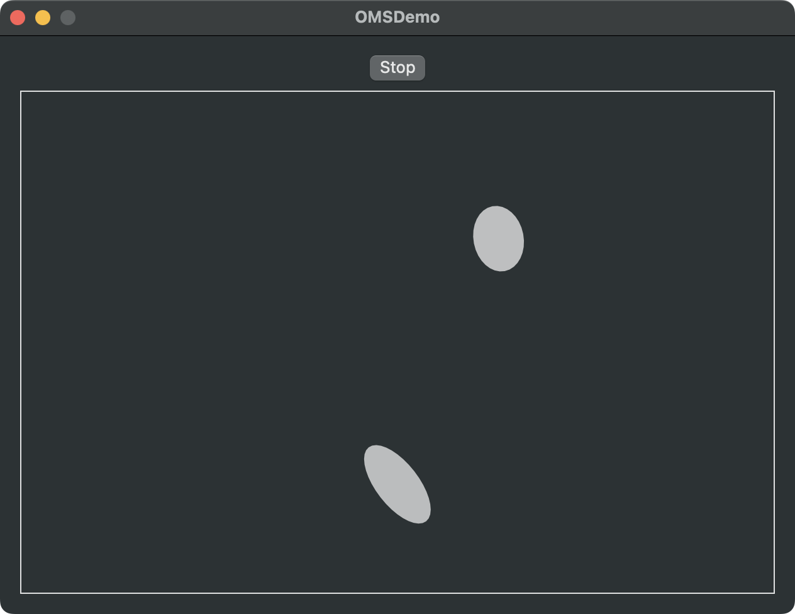

# OpenMultitouchSupport

This enables you easily to observe global multitouch events on the trackpad (only default device).  
I created this library to make MultitouchSupport.framework (Private Framework) easy to use.

## References

This library refers the following frameworks very much. Special Thanks!

- [mhuusko5/M5MultitouchSupport](https://github.com/mhuusko5/M5MultitouchSupport)
- [calftrail/Touch](https://github.com/calftrail/Touch/blob/master/TouchSynthesis/MultitouchSupport.h)

## Requirements

- Development with Xcode 16.0+
- swift-tools-version: 6.0
- Compatible with macOS 13.0+

## Demo



## Usage

App SandBox must be disabled to use OpenMultitouchSupport.

```swift
import OpenMultitouchSupport

let manager = OMSManager.shared()

Task { [weak self, manager] in
    for await touchData in manager.touchDataStream {
        // use touchData
    }
}

manager.startListening()
manager.stopListening()
```

### The data you can get are as follows

```swift
struct OMSPosition: Sendable {
    var x: Float
    var y: Float
}

struct OMSAxis: Sendable {
    var major: Float
    var minor: Float
}

enum OMSState: String, Sendable {
    case notTouching
    case starting
    case hovering
    case making
    case touching
    case breaking
    case lingering
    case leaving
}

struct OMSTouchData: Sendable {
    var id: Int32
    var position: OMSPosition
    var total: Float // total value of capacitance
    var pressure: Float
    var axis: OMSAxis
    var angle: Float // finger angle
    var density: Float // area density of capacitance
    var state: OMSState
    var timestamp: String
}
```
